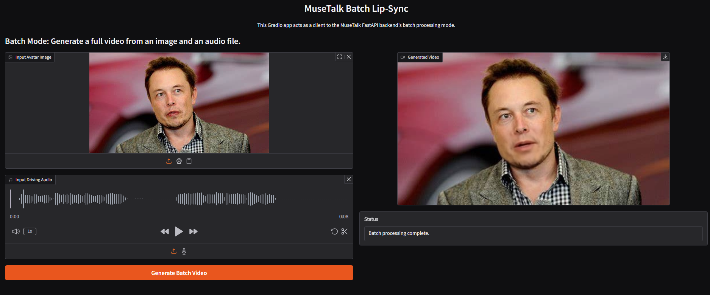

# LiveAct

LiveAct is a demonstration project for a lip-syncing API that uses a Generative AI model (MuseTalk) to animate a speaking person from an audio file and a person's image. It provides a WebSocket endpoint for interaction.



Gradio UI

Powered by MuseTalk: <https://github.com/TMElyralab/MuseTalk>

- [LiveAct](#liveact)
  - [Objective](#objective)
  - [System Overview](#system-overview)
  - [Pretrained Models](#pretrained-models)
  - [Docker Setup (Server)](#docker-setup-server)
  - [NVIDIA GPU Drivers Setup](#nvidia-gpu-drivers-setup)
  - [Client Setup (Local)](#client-setup-local)
  - [Local setup](#local-setup)
  - [Running and Testing the API](#running-and-testing-the-api)
    - [1. Start the Server (Docker)](#1-start-the-server-docker)
    - [2. Test with `client_test_batch.py`](#2-test-with-client_test_batchpy)
    - [3. Test with `gradio_frontend.py`](#3-test-with-gradio_frontendpy)
    - [4. Test with the Browser Test Page](#4-test-with-the-browser-test-page)
    - [5. Test with a Generic WebSocket Client](#5-test-with-a-generic-websocket-client)
      - [Payload Format](#payload-format)
      - [Success Response Format](#success-response-format)
      - [Error Response Format](#error-response-format)
  - [Project Structure](#project-structure)

## Objective

The primary goal of this project is to develop a WebSocket API that:

1. Accepts a base64-encoded audio file and a base64-encoded image of a person.
2. Utilizes the MuseTalk open-source lip-syncing model to process these inputs.
3. Generates a video of the person's face talking, lip-synced with the input audio.
4. Returns the generated video (as base64) to the client.
5. Is containerized using Docker for ease of deployment and consistent environment.

## System Overview

The system is comprised of the following key components:

1. **FastAPI Server (`main.py`):**
    - Runs inside a Docker container.
    - Exposes a WebSocket endpoint (`/ws/lipsync/batch`) for communication.
    - Handles incoming requests, decodes base64 inputs (image and audio).
    - Orchestrates the lip-syncing process using the MuseTalk model.
    - Encodes the generated video output to base64 and sends it back to the client.
    - Loads AI models into memory once at startup (using FastAPI's `lifespan` event) for efficient subsequent requests.

2. **MuseTalk Model & Adapter (`musetalk_adapter_batch.py`):**
    - The core generative AI model responsible for lip-syncing.
    - The adapter script provides a simplified interface to the MuseTalk library for generating video from a single image and an audio file.
    - It processes the input image for facial landmarks, extracts audio features, and then uses the MuseTalk UNet and VAE to generate video frames. These frames are then compiled into an MP4 video.

3. **WebSocket Communication:**
    - Used for bi-directional communication between the client and the FastAPI server.
    - Currently implemented in a request-response pattern for batch processing: the client sends one message with image and audio, and the server sends one message back with the video.

4. **Docker Containerization:**
    - The `Dockerfile` defines the environment to build and run the FastAPI server.
    - It handles OS dependencies, Python setup, installation of all required libraries (including PyTorch, CUDA-specific packages, and MuseTalk dependencies), and model downloads.
    - This ensures the application runs consistently across different environments.

5. **Temporary File Handling:**
    - The server temporarily saves the decoded input image and audio, as well as intermediate video frames, to disk within a unique directory for each request (inside the `temp_files` directory in the container).
    - These temporary files are cleaned up after each request is processed or if a client disconnects.

## Pretrained Models

The system relies on several pretrained models, primarily for the MuseTalk pipeline:

- **MuseTalk V1.5 Weights:** Core models for generating lip movements (UNet).
- **SD VAE (Stable Diffusion VAE):** Used for encoding images to latent space and decoding latents back to images.
- **Whisper (OpenAI):** For audio feature extraction.
- **DWPose:** For pose estimation (though less critical for single-image batch mode, it's part of the broader MuseTalk ecosystem).
- **SyncNet:** For audio-visual synchronization (part of the broader MuseTalk ecosystem).
- **Face Parsing Models:** For segmenting facial regions, used in blending the generated mouth onto the original image.

**Loading Logic:**

- These models are automatically downloaded from Hugging Face Hub and other sources by the `download_weights.sh` script during the Docker image build process (see `RUN ./download_weights.sh` in the `Dockerfile`).
- The models are stored within the `MuseTalk/models/` directory inside the Docker image.
- Upon server startup, the `lifespan` event manager in `main.py` loads these models into GPU memory (if available) using helper functions from the MuseTalk library. This pre-loading makes subsequent API requests faster as models don't need to be loaded each time.

## Docker Setup (Server)

The server application is designed to run inside a Docker container.

```bash
# 0. Clone the repo
git clone https://github.com/phamlequocdatCS/LiveAct

# 1. Build the docker image
docker build -t musetalk-batch-api .

# 2. Create and run the docker image
# This command maps port 8000 of the container to port 8000 on your host
# and enables GPU access (remove --gpus all if you don't have an NVIDIA GPU
# and the model/PyTorch supports CPU, though performance will be much slower).
docker run -p 8000:8000 --name musetalk-api-test --gpus all musetalk-batch-api

# --- Other useful Docker commands ---

# Restart a stopped docker image
docker start musetalk-api-test
# View logs (useful for debugging startup issues or request processing)
docker logs -f musetalk-api-test

# Stop the docker image
docker stop musetalk-api-test

# Clean Docker build cache (if you need to free up space or force rebuild layers)
docker builder prune
```

After starting the container, the API server will be accessible at `ws://localhost:8000/ws/lipsync/batch` and a simple HTML test page at `http://localhost:8000/`.

## NVIDIA GPU Drivers Setup

To run with GPU, you need to install the NVIDIA GPU Driver

1. Provision a Server: Get a Linux server with a compatible NVIDIA GPU.
2. Install NVIDIA Driver: Install the appropriate NVIDIA kernel driver for the GPU on the server's operating system.
3. Install Docker Engine: Install the Docker daemon on the server.
4. Install NVIDIA Container Toolkit

```bash
curl -s -L https://nvidia.github.io/libnvidia-container/stable/deb/nvidia-container-toolkit.list | sudo tee /etc/apt/sources.list.d/nvidia-container-toolkit.list

# Add the GPG key
curl -s -L https://nvidia.github.io/libnvidia-container/gpgkey | sudo apt-key add -

# Update package lists
sudo apt-get update

# Install the NVIDIA Container Toolkit
sudo apt-get install -y nvidia-container-toolkit

# Configure the Docker daemon (Path might vary slightly, check official docs if this fails)
sudo nvidia-container-toolkit -d /usr/bin/docker-current

# Restart the Docker daemon (or restart Docker Desktop/WSL)
sudo systemctl restart docker # Or service docker restart

# Test driver install
docker run --rm --gpus all nvidia/cuda:11.8.0-runtime-ubuntu22.04 nvidia-smi
```

## Client Setup (Local)

The provided client scripts (`client_test_batch.py` and `gradio_frontend.py`) are intended to be run on your local machine (outside the Docker container) to interact with the server.

```bash
# 1. Create Python virtual environment and activate
python -m venv venv
.\venv\Scripts\activate
# source venv/bin/activate

# 2. Install dependencies
pip install websockets
pip install -U gradio

# or
# pip install -r requirements_client.txt
```

## Local setup

```bash
python -m venv venv
.\venv\Scripts\activate

# General dependencies
pip install fastapi uvicorn[standard] websockets python-multipart opencv-python ffmpeg-python

# MuseTalk dependencies
pip install torch==2.0.1 torchvision==0.15.2 torchaudio==2.0.2 --index-url https://download.pytorch.org/whl/cu118

# MuseTalk
pip install --no-cache-dir -U openmim
mim install mmengine
mim install "mmcv==2.0.1"
mim install "mmdet==3.1.0"
mim install "mmpose==1.1.0"

# download_weights.sh

pip install -r MuseTalk/requirements.txt
```

## Running and Testing the API

### 1. Start the Server (Docker)

Ensure your Docker container (`musetalk-api-test`) is running as described in the [Docker Setup](#docker-setup-server) section.

### 2. Test with `client_test_batch.py`

This script sends a predefined image and audio file to the server and saves the resulting video.

- **Verify Paths:** Open `client_test_batch.py` and ensure the `image_path` and `audio_path` variables point to valid files accessible from the script's location. Default paths use example assets from the `MuseTalk/` directory.
- **Run the script:**

    ```bash
    python client_test_batch.py
    ```

    If successful, it will print status messages and save an `output_batch_video.mp4` in the same directory as the script.

### 3. Test with `gradio_frontend.py`

This script launches a Gradio web interface for a more user-friendly way to test the API.

- **Run the script:**

    ```bash
    python gradio_frontend.py
    ```

    Open your web browser and go to the local URL provided by Gradio (usually `http://127.0.0.1:7860`).
    You can upload an image and an audio file, then click "Generate Batch Video" to see the result.

### 4. Test with the Browser Test Page

The server provides a very basic HTML page for testing the WebSocket connection directly from your browser.

- Open your web browser and navigate to `http://localhost:8000/`.
- You'll find input fields for base64 image and audio strings. You'll need to manually convert your image/audio to base64 (e.g., using an online tool or a simple script) and paste the strings there.
- Click "Send Batch Data". The response and video (if successful) will be displayed on the page.

### 5. Test with a Generic WebSocket Client

You can use any WebSocket client tool or write a custom script to interact with the API.

- **Endpoint:** `ws://localhost:8000/ws/lipsync/batch`

#### Payload Format

The client must send a JSON string with the following structure:

```json
{
    "image_base64": "YOUR_BASE64_ENCODED_IMAGE_STRING",
    "audio_base64": "YOUR_BASE64_ENCODED_AUDIO_STRING"
}
```

- `image_base64`: A string containing the base64-encoded data of the input image (e.g., PNG, JPG).

- `audio_base64`: A string containing the base64-encoded data of the input audio (e.g., WAV, MP3).

#### Success Response Format

If processing is successful, the server responds with a JSON string:

```json
{
    "status": "success",
    "message": "Video generated successfully.",
    "video_base64": "BASE64_ENCODED_MP4_VIDEO_STRING"
}
```

- `video_base64`: A string containing the base64-encoded data of the generated MP4 video.

```json
Loading image from: MuseTalk\assets\demo\musk\musk.png
Loading audio from: MuseTalk\data\audio\yongen.wav
Connecting to ws://localhost:8000/ws/lipsync/batch...
Sending data: {'image_base64': 'iVBORw0KGgoAAAANSUhEUgAAAdoAAA...', 'audio_base64': 'UklGRkZwFwBXQVZFZm10IBAAAAABAA...'}
Data sent. Waiting for response...
Received from server: {"status":"success","message":"Video generated successfully.","video_base64":"AAAAIGZ0eXBpc29tAAACAGlzb21pc28yYXZjMW1wNDEAAAAIZnJlZQACbQJtZGF0AAACrgYF//+q3EXpvebZSLeWLNgg2SPu73gyNjQgLSBjb3JlIDE2MyByMz...
Received success response. Attempting to decode video.
Successfully saved to output_batch_video.mp4
Batch video saved to: output_batch_video.mp4
```

#### Error Response Format

If an error occurs, the server responds with a JSON string:

```json
{
    "status": "error",
    "message": "A description of the error that occurred."
}
```

## Project Structure

```bash
.
├── Dockerfile                  # Defines the Docker image for the server
├── download_weights.sh         # Script to download pretrained models (used in Docker build)
├── main.py                     # FastAPI server application with WebSocket endpoint
├── client_test_batch.py        # Python script for command-line testing of the API
├── gradio_frontend.py          # Gradio client interface for the API
├── MuseTalk/                   # MuseTalk library code and assets
├── requirements_client.txt     # Python dependencies for client scripts
└── README.md                   # This file
```
